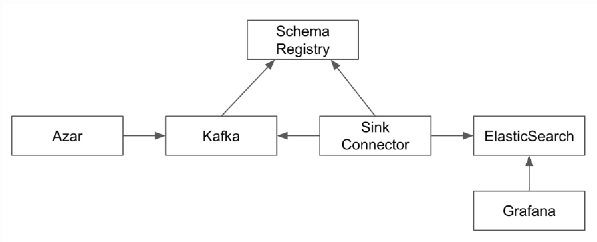

# kafka_system_with_azar
### 카프카 시스템 구성, 아자르 비즈니스 메트릭 생성 프로세스 참조


## AWS Server Setting
### .env 파일 생성
- setting_aws/env_example 참조하여 생성

### keypair.pem 키 생성
- ec2 접속을 위해 keypair.pem 키를 setting_aws 폴더에 생성
- 파일 권한 수정 : sudo chmod 600 setting_aws/keypair.pem

### EC2 서버 실행
```commandline
sh setting_aws/setup_server.sh server_1
sh setting_aws/setup_server.sh server_2
sh setting_aws/setup_server.sh server_3
```

### scp keypair.pem
```commandline
scp -i setting_aws/keypair.pem setting_aws/keypair.pem ec2-user@server_1_ip:~
```

### SSH 접속
```commandline
ssh -i setting_aws/keypair.pem ec2-user@server_1_ip
```

### ansible key-gen ( optional)
```commandline
ssh-agent bash
ssh-add keypair.pem 
ssh-keygen -t rsa -b 4096 -f /home/ec2-user/.ssh/id_rsa -N "" -q
cat /home/ec2-user/.ssh/id_rsa.pub >> /home/ec2-user/.ssh/authorized_keys
```

### group_var host 관련 수정
```commandline
inventory/hosts 파일의 ansible_host 변수 수정
git push
server_1_ip에서 git pull
```

## Zookeeper Setting
### zookeeper 설치
```commandline
cd /home/ec2-user/kafka_system_with_azar/ansible/
ansible-playbook -i inventory/hosts zookeeper.yml
```

### zookeeper 실행 확인
```commandline
systemctl status zookeeper
cat /data/zookeeper/myid
```

## Kafka Setting
### kafka 설치
```commandline
ansible-playbook -i inventory/hosts kafka.yml
```
### kafka 실행 확인
```commandline
# server_1에서 토픽생성 ( 자동토픽생성(Auto Topic Creation)으로 토픽 생성 생략가능 )
/usr/local/kafka/bin/kafka-topics.sh --bootstrap-server kafka_01.com:9092 --create --topic test-overview01 --partitions 1 --replication-factor 3

# server_2에서 consumer 실행 
/usr/local/kafka/bin/kafka-console-consumer.sh --bootstrap-server kafka_01.com:9092 --topic test-overview01


# server_1 producer로 메세지 전송
/usr/local/kafka/bin/kafka-console-producer.sh --bootstrap-server kafka_02.com:9092 --topic test-overview01

# server_2에서 전송 된 메세지 확인
```
